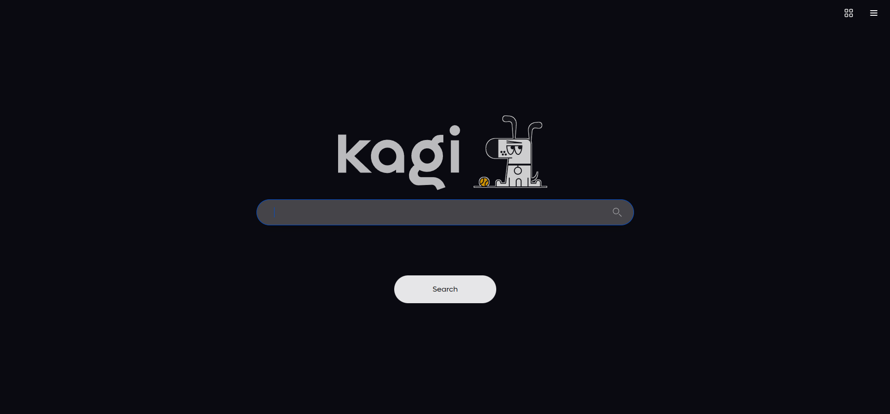
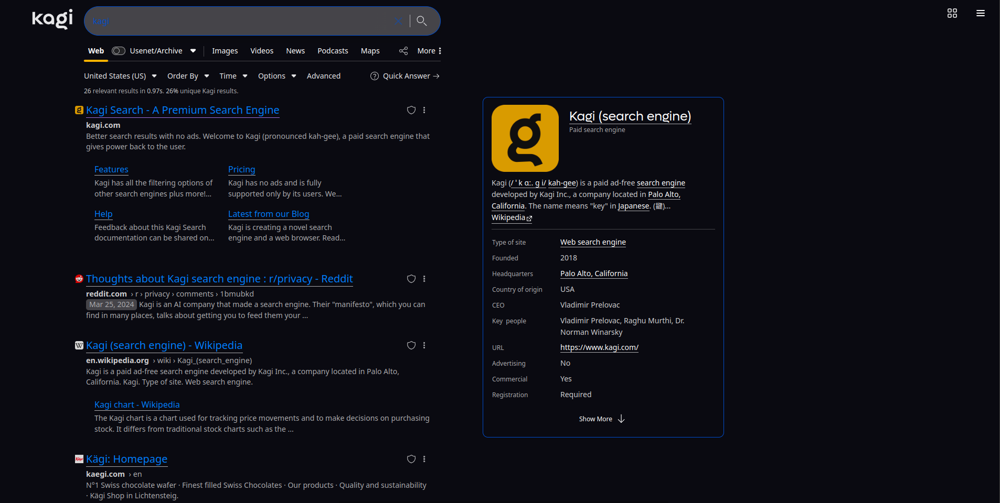
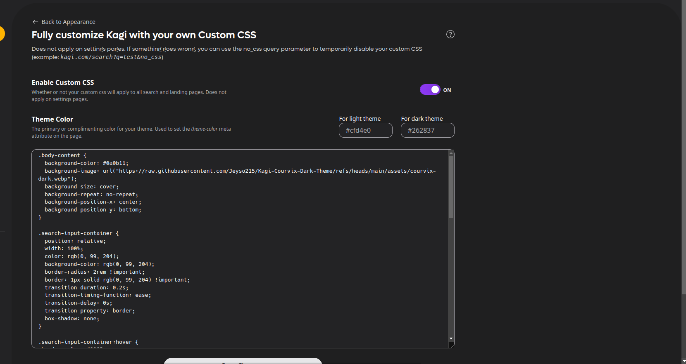

# Kagi-Courvix-Dark-Theme

This repository contains a custom CSS theme for Kagi, inspired by the color palette 106304 from ColorsWall. The theme aims to provide a visually appealing dark mode experience for Kagi users.

## Table of Contents

- [Installation](#installation)
- [Usage](#usage)
- [Screenshots](#screenshots)
- [Contributing](#contributing)
- [License](#license)
- [Learn](#learn)

## Installation

To use this custom theme, follow these steps:

1. Clone this repository to your local machine:
    ```sh
    git clone https://github.com/Jeyso215/Kagi-Courvix-Dark-Theme.git
    ```

2. Navigate to the repository directory:
    ```sh
    cd Kagi-Courvix-Dark-Theme
    ```

3. Copy the CSS file to your Kagi theme directory:
    ```sh
    cp Kagi-Courvix-Dark-Theme.css /path/to/your/kagi/theme/directory/
    ```

4. Apply the theme through your Kagi settings.

## Usage

Once the theme is installed, you can activate it through the Kagi settings menu. Simply select "Kagi-Courvix-Dark-Theme" from the list of available themes.

## Screenshots

Here are some screenshots of the Kagi-Courvix-Dark-Theme in action:





## Contributing

Contributions are welcome! If you have suggestions for improvements or have found any bugs, please open an issue or submit a pull request. Make sure to follow the [contributing guidelines](CONTRIBUTING.md).

## License

This project is licensed under the AGPL v3.0 License. See the [LICENSE](LICENSE.md) file for details.

## Learn

# Learn

If you want to learn more about how to customize your Kagi Search CSS, below is a video tutorial. The video features a slightly older design of Kagi Search, but the CSS principles are the same.


Also, here are some web resources about how to use CSS in general:

[Kagi Custom CSS Docs](https://help.kagi.com/kagi/features/custom-css.html)
[MDN Web Docs](https://developer.mozilla.org/en-US/docs/Learn_web_development/Core/Styling_basics)
[W3Schools](https://www.w3schools.com/css/css_intro.asp)
[Khan Academy](https://www.khanacademy.org/computing/computer-programming/html-css/intro-to-css/pt/css-basics)
[freeCodeCamp](https://www.freecodecamp.org/news/get-started-with-css-in-5-minutes-e0804813fc3e/)
